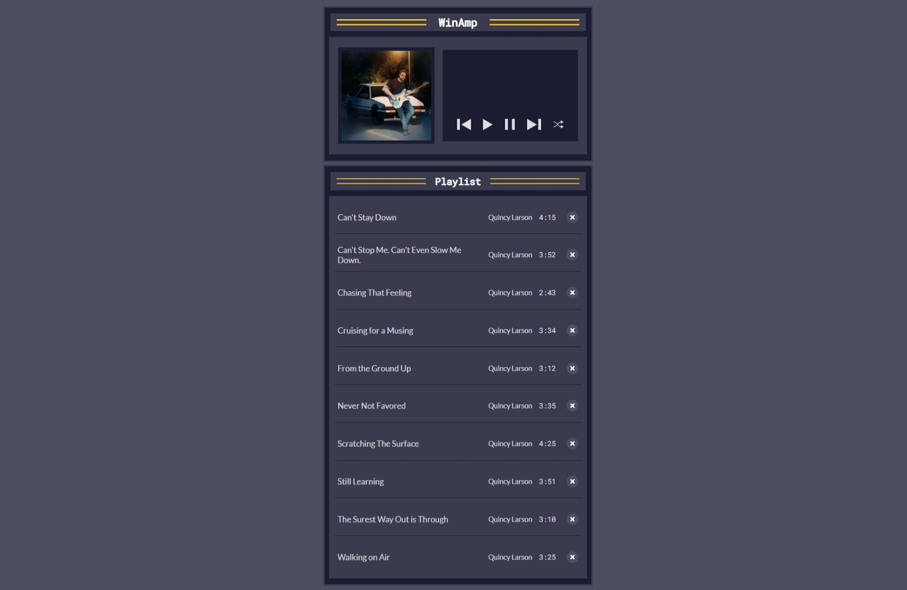

# Music Player App with Web Audio API

This is a music player app built with HTML, CSS, and JavaScript, utilizing the Web Audio API for playback functionality.
The app allows users to play, pause, delete from the playlist, and switch to shuffle mode.
It also includes a feature to reset the playlist when it is empty.

